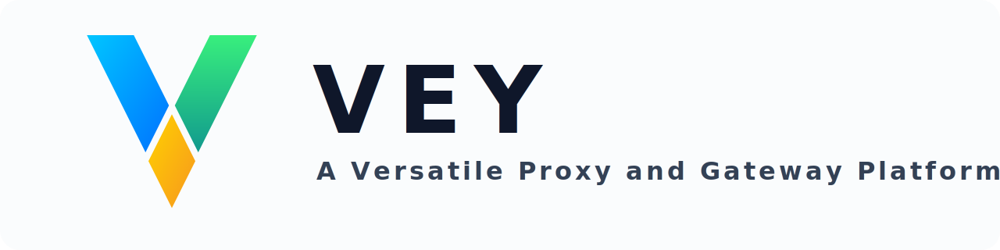

[English README](README.md) | [日本語 README](README.ja_JP.md)

## 关于

VEY（Versatile Edge Way）是一个面向企业场景的通用代理解决方案项目，可用于构建正向代理、反向代理（开发中）、
负载均衡（待定）、NAT 穿透（开发中）等能力。

本项目由 [G3 项目](https://github.com/bytedance/g3) 原作者 fork 并发起。

如果您要迁移现有的 G3 部署，请参阅[从 G3 迁移到 VEY](doc/migrate_from_g3_to_vey.md)。

## 应用程序

VEY 项目由多个应用组成，每个应用都有独立的子目录，用于存放各自的代码、文档及相关资源。

除各应用目录外，仓库中还包含一些公共目录：

- [doc](doc) 包含项目级文档。
- [sphinx](sphinx) 用于生成各应用的 HTML 参考文档。
- [scripts](scripts) 包含各类辅助脚本，例如覆盖率测试和打包脚本。

### vey-proxy

高功能的通用代理守护进程。它以正向代理为核心，同时支持透明代理、TCP/TLS 流代理、选择性反向代理、
流量检测以及基于策略的请求处理。

#### 主要特性

- 基于 Async Rust 的高性能实现
- 支持 HTTP/1、SOCKS5 正向代理，以及 SNI Proxy 与 TCP TPROXY
- 支持代理串联与多种出口选路方式，也可接入自定义选路 Agent
- 支持 TCP/TLS 流代理与基础 HTTP 反向代理
- TLS 支持 OpenSSL、BoringSSL、AWS-LC、AWS-LC-FIPS、Tongsuo 与 rustls
- 支持 TLS 拦截、解密流量导出，以及 HTTP/1、HTTP/2、IMAP、SMTP 检测
- 支持面向常见应用层检测流程的 ICAP 集成
- 提供灵活的认证、ACL、限速限流与按用户细化的策略控制
- 提供覆盖入口、出口、用户、用户站点等维度的详细指标与日志
- 支持优雅重载，以及灵活的负载均衡与故障切换策略

[详细介绍](vey-proxy/README.md) | [用户指南](vey-proxy/UserGuide.zh_CN.md) |
[参考文档](https://vey.readthedocs.io/projects/proxy/en/latest/)

### vey-statsd

兼容 StatsD 的指标接入、聚合与转发服务。它可以接收应用发来的指标数据，在模块化流水线中完成规范化或聚合，再输出到
Graphite、OpenTSDB、InfluxDB 等下游系统。

[详细介绍](vey-statsd/README.md) | [参考文档](https://vey.readthedocs.io/projects/statsd/en/latest/)

### vey-gateway

一个仍在开发中的通用反向代理 / 网关守护进程。它被设计成可支持多种前端协议与上游协议的可编程网关框架，目前已经支持
TLS 与 keyless 相关的流量处理能力。

[详细介绍](vey-gateway/README.md) |
[参考文档](https://vey.readthedocs.io/projects/gateway/en/latest/)

### vey-bench

压测工具，支持：

- HTTP: HTTP/1.1, HTTP/2, HTTP/3
- WebSocket
- TLS Handshake
- DNS: UDP, TCP, DNS over TLS, DNS over HTTP, DNS over QUIC, DNS over HTTP/3
- Thrift RPC
- Cloudflare Keyless

[详细介绍](vey-bench/README.md)

### vey-mkcert

用于生成根 CA / 中间 CA / TLS 服务端 / TLS 客户端 / 国密服务端 / 国密客户端证书的工具。

[详细介绍](vey-mkcert/README.md)

### vey-dcgen

适用于 vey-proxy TLS 劫持功能的动态证书生成服务。

[详细介绍](vey-dcgen/README.md)

### vey-iploc

适用于 vey-proxy GeoIP 功能的 IP 地理位置查询服务。

[详细介绍](vey-iploc/README.md)

### vey-keyless

Cloudflare Keyless SSL 协议的服务端实现。它可以让 TLS 边缘服务把私钥运算委托给独立后端，从而更容易实现密钥集中管理，
并集成基于 OpenSSL 的硬件加速能力。

[详细介绍](vey-keyless/README.md) |
[参考文档](https://vey.readthedocs.io/projects/keyless/en/latest/)

## 支持平台

目前已完整支持 Linux。

以下平台也可以编译：

- macOS
- Windows >= 10
- FreeBSD >= 14.3
- NetBSD >= 10.1
- OpenBSD >= 7.8

## 开发环境搭建

参考 [Dev-Setup](doc/dev-setup.md)。

## 标准及约定

参考 [Standards](doc/standards.md)。

## 构建、打包及部署

预编译包可在 [cloudsmith](https://cloudsmith.io/~vey-oss/repos/) 获取。

但仍推荐自行编译并打包，具体方法请参考 [Build and Package](doc/build_and_package.md)。

### 长期支持版本

参考 [Long-Term Support](doc/long-term_support.md)。

## 贡献指南

参考 [Contributing](CONTRIBUTING.md)。

## 贡献者公约

参考 [Code of Conduct](CODE_OF_CONDUCT.md)。

## 安全

如发现安全问题，请在 GitHub 上
[创建 security advisory 草稿](https://github.com/VEY-OSS/vey/security/advisories/new)，不要直接提交公开 issue。

## 许可证

本项目基于 [Apache-2.0 License](LICENSE) 发布。
